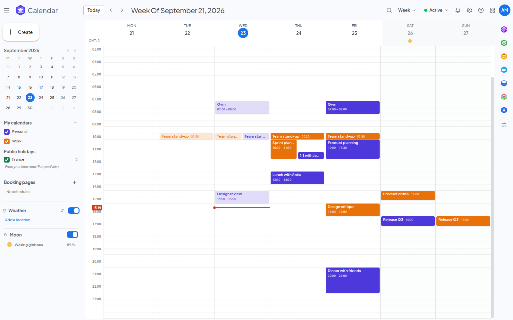
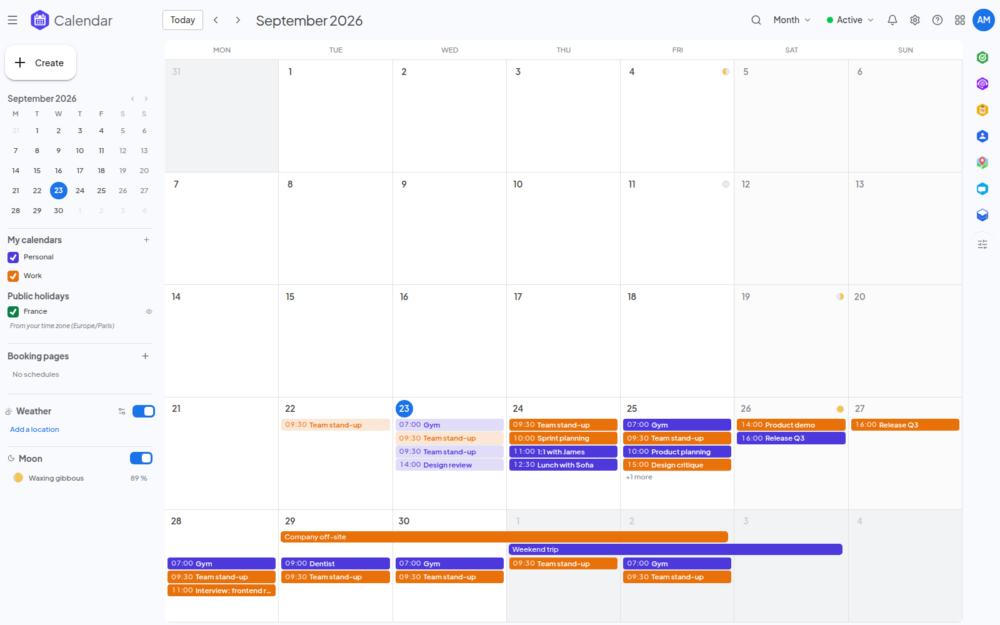

<!--
  SPDX-FileCopyrightText: 2026 Kubuno contributors
  SPDX-License-Identifier: AGPL-3.0-or-later
-->

<div align="center">


# Kubuno — Calendar

[](LICENSE)


**Events, scheduling and CalDAV sync for [Kubuno](https://github.com/kubuno/core) — the self-hosted, libre (AGPLv3) cloud platform, a sovereign alternative to Google Workspace and Microsoft 365.**

Manage your calendars, invite people and find a common time, publish bookable
availability, and sync with your devices over CalDAV — all self-hosted.

</div>

---

## Screenshots



<sub>Week view with colour-coded calendars</sub>



<sub>Month view</sub>

## Features

- **Day / Week / Month / Year views** — each with its own URL (`/calendar/day`, `/calendar/week`…), navigable and shareable, with drag & resize to move an event or adjust its times directly.
- **Quick create** — clicking a slot draws a provisional block and opens a small card carrying what an event needs (title, day, guests, video meeting, place, description, calendar); **More options** hands everything typed to the full editor. One card serves both creating and editing an event.
- **Recurrence (RRULE)** — repeating events with scope selection (this event / this and following / all), a full custom-recurrence editor and humanized rule summaries.
- **Attendees & scheduling** — invite people from the instance directory or your contacts (with faces), mark a guest optional, and enforce real guest permissions (may modify / may invite / may see the guest list). A guest already busy at that hour is flagged, and clicking a guest opens their card with the actions the installed modules can perform.
- **"Find a time" grid** — a navigable day/week calendar showing your events, your guests' busy bands and the meeting as a block you drag onto the hour that works, in your own zone and an optional second one.
- **Meeting rooms** — invite a room from the organisation's directory; it accepts when free and declines (naming the meeting that holds it) when taken, checked occurrence by occurrence for recurring meetings, with automatic release and usage reporting.
- **Bookable appointment schedules** — publish your availability (durations, buffers, booking windows, per-day caps, custom form fields) and let anyone book a slot on a standalone public page; bookings land on your calendar with e-mail confirmations and reminders.
- **Invitations by e-mail (iCalendar)** — meeting invitations are e-mailed to guests with an `.ics` attachment and Yes / No / Maybe answer links, so anyone can reply from their own mail client without an account; RSVPs are reflected back on the event automatically.
- **Video meetings** — an event carries a video-call link of its own, typed, pasted, or created in place by whichever installed module hosts meetings; an event and its call keep one shared title.
- **Calendar sharing & subscriptions** — share a calendar in view or edit mode, hand out a public read-only `.ics` feed, and follow any remote iCalendar feed (`https://`/`webcal://`) that refreshes hourly and on demand.
- **CalDAV** — sync with your phone and desktop clients.
- **Delta sync API** — cursor-based change feeds with tombstones (calendars, events, time blocks) for local-first clients.
- **Cross-module labels** — attach the instance's own labels to an event, at creation time and in both the quick card and the full editor.
- **Built-in weather & moon phases** — per-location forecasts (hourly strip, charts, wind compass, sunrise/sunset arc, air quality, 7-day forecast) and optional principal-phase moon markers computed client-side.
- **Cross-app events** — copy an event as a rich card and paste it into other Kubuno apps; other modules can open the event picker as a service.
- **Your choice of database** — runs on PostgreSQL, MySQL/MariaDB or SQLite, picked by the administrator in configuration and read at start-up; SQLite needs no database server at all, which makes a single-machine or evaluation install trivial.
- **i18n** — 13 languages, with dates and times written by the platform in each reader's own language.

## Architecture

Calendar is a **Kubuno module**: a standalone Rust process (port `3102`) that registers with the [core](https://github.com/kubuno/core) at startup. The core proxies its routes (`/api/v1/calendar/*`) and serves its runtime-loaded frontend bundle.

```
core (kubuno/core)  ──proxy──►  kubuno-calendar (this repo, :3102)
       │                              ├─ Rust backend (Axum + SQLx; PostgreSQL, MySQL/MariaDB or SQLite)
       └─ serves /modules/calendar/entry.js (React frontend, loaded at runtime)
```

- **Backend** — `src/`: Axum + SQLx through the shared `kubuno-db` layer — PostgreSQL (schema `calendar`), MySQL/MariaDB or SQLite; migrations in `migrations/`.
- **Frontend** — `frontend/`: a React bundle built to `entry.js`, consuming `@kubuno/sdk`, `@kubuno/ui` and `@kubuno/drive` from npm (provided by the host at runtime via the import map).

## Install

Modules install as a **Kubuno package (`.kbpkg`)** — a single, self-contained archive the Kubuno server unpacks itself (in pure Rust, identically on Linux, Windows and macOS). There are no native system packages for a module; only the core ships those.

The easiest way to self-host a full Kubuno instance (core + every module) is the **all-in-one [Docker image](https://github.com/kubuno/docker)** (`ghcr.io/kubuno/kubuno`), which already bundles Calendar.

To build and install this module on its own:

```bash
bash build_kbpkg.sh --install        # build → install into the store → restart the core
```

Or install a prebuilt `.kbpkg` (offline, no catalogue required):

```bash
sudo kubuno modules:install dist/calendar-<version>-<os>-<arch>.kbpkg
sudo systemctl restart kubuno        # the core loads the module on (re)start
```

A `.kbpkg` is attached to every tagged [GitHub Release](https://github.com/kubuno/calendar/releases) (Linux via `build.yml`, Windows/macOS via `dist.yml`).

## Build & development

**Requirements:** Rust ≥ 1.82, Node.js ≥ 24, and PostgreSQL 16, MySQL/MariaDB or SQLite (no server needed).

```bash
cargo build --release                      # → target/release/kubuno-calendar
cd frontend && npm ci && npm run build      # → dist/{entry.js, entry.css, chunks/}
bash build_kbpkg.sh                         # → dist/calendar-<version>-<os>-<arch>.kbpkg
```

> Shared dependencies come from Kubuno — no `kubuno/core` checkout required:
> - **Rust** — shared crates via tagged git dependencies on `kubuno/core`.
> - **Frontend** — `@kubuno/sdk`, `@kubuno/ui`, `@kubuno/drive` from the `@kubuno` npm scope. They are `external` at runtime (the host provides the singletons via its import map); the npm packages supply the build-time type surface.

## Configuration

Copy `config.toml.example` → `config.toml`, or use environment variables (`KUBUNO_CORE_URL`, `KUBUNO_INTERNAL_SECRET`, `KUBUNO_DB_*`). The database engine is the administrator's choice, set in `[database] engine` — `postgres` (default), `mysql`/`mariadb` or `sqlite` — and read at start-up: the same binary connects to whichever is named, and SQLite needs no server at all. Under the Kubuno supervisor the connection settings are injected by the core. See `module.toml` for the manifest (id, port, routes, sidebar entry, settings).

## Tech stack

Rust 2021 · Axum 0.7 · Tokio · SQLx 0.9 via `kubuno-db` (PostgreSQL, MySQL/MariaDB or SQLite; schema `calendar`) — React 19 · TypeScript · Vite · Tailwind CSS v4 · Zustand · React Query.

## Contributing

Issues and pull requests are welcome. For any significant change, please open an issue first.

## License

[AGPL-3.0-or-later](LICENSE) © Kubuno contributors.
